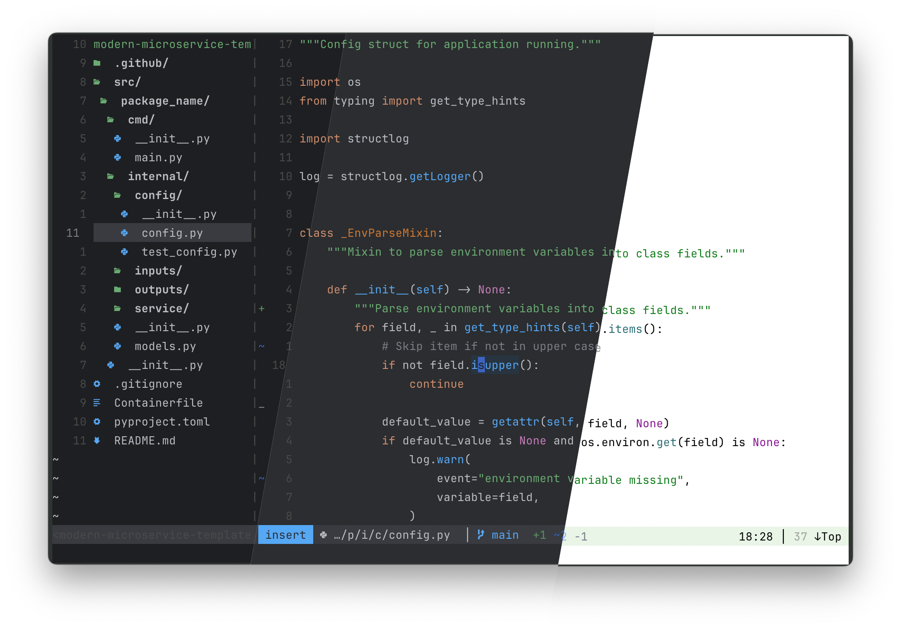

<div align="center">
    </br>
    
    <h3>JB for Vim</h3>
    <p> A set of colour schemes for Vim, inspired by Jetbrains' IDEs.</p>
</div>




Features
---------------------------------------------------------------------------

**Familiar Look**

Not only are the colours accurate to the default JetBrains themes, they 
also attempt to emulate the original colour hierarchy. For instance, JSON
keywords are highlighted in the `Constant` colour, not the keyword colour.
This of course is limited by the available highlight groups in Vim, and
even with [vim-polyglot](https://github.com/sheerun/vim-polyglot) it is
not possible to get an exact match, so expect a best-effort outcome.

**Multiple Palettes**

Three palette options are packaged: 
- `dark`: Uses the colours from the 'Dark' JetBrains theme
- `light`: For those who prefer a light theme, follows the 'Light' theme
- `mid`: A bonus theme - The `dark` palette with a lighter background

**Bring Your Own Colours**

Any of the palette colours can be overridden. See 
[Configuration](#configuration) or
[:help g:jb_color_overrides](doc/jb.txt) for how to
implement your own colours.
Highlight groups can also be modified in an autoload group to change
the look of the plugin.

**Semantic language syntax highlighting**

Includes more in depth highlighting rules, ported from the original
themes, in accordance with the highlight groups of the language syntax
packs in [vim-polyglot](https://github.com/sheerun/vim-polyglot). It is
recommended you install polyglot alongside this colorscheme for the best
highlighting.

**Truecolor, cterm, and italic support**

Whilst built with true colours in mind, vim-jb's schemes also support 256
colour terminals. You can also opt-in to italics if your terminal emulator
supports them. See [Configuration](#configuration) or 
[:help jb-configuration](doc/jb.txt) for more details.

**Plugins out the box**

Includes highlight links for popular Vim plugins such as GitGutter,
NERDTree, ALE, FZF, Fugitive, and more. For those without included groups,
the `JB*` top-level highlight groups in the plugin configuration allow for 
easy and clear custom mapping in a `.vimrc` that won't affect other
schemes. See [colors/jb.vim](colors/jb.vim) for the groups.


Installation
---------------------------------------------------------------------------

Using [vim-plug](https://github.com/junegunn/vim-plug) (or your package
manager of choice):

```vim
Plug 'devsjc/vim-jb'
```


Usage
---------------------------------------------------------------------------

Place the following line at the bottom of your `.vimrc`:

```vim
colorscheme jb
```


Configuration
--------------------------------------------------------------------------

*Note*: All configuration must be placed before the `colorscheme jb` line.
Further configuration details can be found via
[:help jb-configuration](doc/jb.txt).

**Choosing the style**

The style is set with `g:jb_style` variable. For instance:

```vim
let g:jb_style='mid'
colorscheme jb
```

**Enabling italics**

If your terminal emulator supports italics, opt in using

```vim
let g:jb_enable_italics=1
colorscheme jb
```

**Enabling Unicode**

If your terminal emulator/font support unicode, opt in using

```vim
let g:jb_enable_unicode=1
colorscheme jb
```

**Modifying a color**

To choose your own colour, pick a category from the
[palettes](autoload/palettes.json) file, and define your overrides in a
dictionary containing your replacement `gui` and `cterm` colours:

```vim
let g:jb_color_overrides={
    \"keyword": {"gui": "#ff00ff", "cterm": "16"}
    \}
```

You can also change highlight groups, overriding what is set in the plugin.
Say you prefer how Android Studio uses the `Type` colour for Kotlin
structures, instead of the less saturated `Keyword` of IntelliJ Idea.
Simply add the following overrides in an `augroup` in your `.vimrc`:

```vim
augroup JBHiglights
    autocmd!
    autocmd ColorScheme * highlight link ktStructure Type
augroup END
```

This must be placed in an `augroup` to prevent vim-jb from overriding it.

Related Projects
---------------------------------------------------------------------------

- Iterm2 themes: [terminals-jb](https://github.com/devsjc/terminals-jb)
- Kitty themes: [terminals-jb](https://github.com/devsjc/terminals-jb)


Contribution and support
---------------------------------------------------------------------------

Enjoy the theme? Give it a star on GitHub! Feel free to create pull
requests with any new highlight rules that have been missed.
