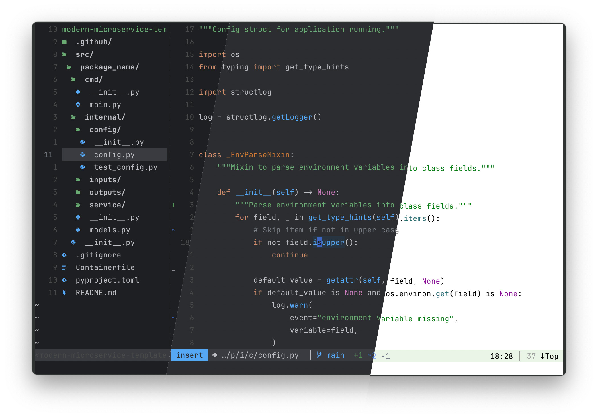

A set of colour schemes for Vim, inspired by Jetbrains' IDEs.

Features
---------------------------------------------------------------------------

**Familiar Look**

Not only are the colours accurate to the default JetBrains themes, they 
also attempt to emulate the original colour hierarchy. For instance, JSON
keywords are highlighted in the `Constant` colour, not the keyword colour.

**Multiple Palettes**

Three palette options are packaged: 
- `dark`: Uses the colours from the 'Dark' JetBrains theme
- `light`: For those who prefer a light theme, follows the 'Light' theme
- `mid`: A bonus theme: The `dark` palette with a lighter background

**Bring Your Own Colours**

Any of the palette colours can be overridden. See 
[Configuration](#configuration) or
[:help g:jb_color_overrides](doc/jb.txt) for how to
implement your own colours.

**Truecolor, cterm,  and italic support**

Built with true colours in mind, these schemes also support 256 colour
terminals. You can also opt-in to italics if your terminal emulator supports
them. See [Configuration](#configuration) or 
[:help jb-configuration](doc/jb.txt) for more details.


Installation
---------------------------------------------------------------------------

Using [vim-plug](https://github.com/junegunn/vim-plug) (or your package
manager of choice):

```vim
Plug 'devsjc/vim-jb'
```


Usage
---------------------------------------------------------------------------

Place the following line at the bottom of your `.vimrc`:

```vim
colorscheme jb
```


Configuration
--------------------------------------------------------------------------

*Note*: All configuration must be placed before the `colorscheme jb` line.
Further configuration details can be found via
[:help jb-configuration](doc/jb.txt).

**Choosing the style**

The style is set with `g:jb_style` variable. For instance:

```vim
let g:jb_style='mid'
colorscheme jb
```

**Enabling italics**

If your terminal emulator supports italics, opt in using

```vim
let g:jb_enable_italics=1
colorscheme jb
```

**Modifying a color**

To choose your own colour, pick a category from the
[palettes](autoload/palettes.json) file, and define your overrides in a
dictionary containing your replacement `gui` and `cterm` colours:

```vim
let g:jb_color_overrides={
    \"keyword": {"gui": "#ff00ff", "cterm": "16"}
    \}
```


Related Projects
---------------------------------------------------------------------------

- Iterm2 Themes (coming soon!)

